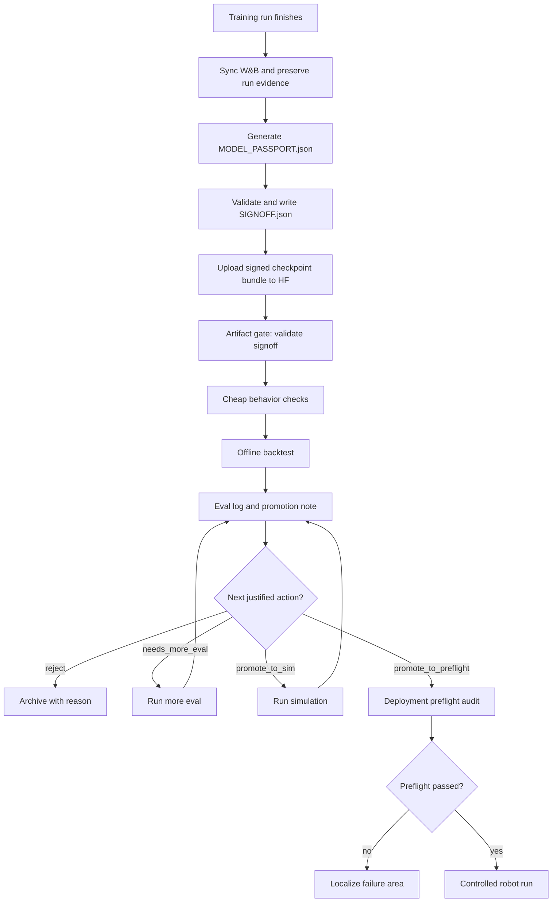

# Checkpoint Lifecycle Roadmap

## Purpose

AutoHPC started as a way to speed up the path from local container work to
training on HPC. That worked, but it created the next bottleneck: checkpoints
are now easy to produce, upload, and forget. The next workflow should help an
agent and human operator decide which signed checkpoints deserve more
attention, which should be archived, and which have enough evidence to move
toward simulation, deployment preflight, or a controlled robot run.

This is not an automation plan yet. Follow the five-step order:

1. Make the requirements less wrong.
2. Delete unnecessary process.
3. Simplify and standardize the manual path.
4. Accelerate with small templates or thin helpers.
5. Automate last.

The first version should be manual, evidence-rich, and file-backed. It should
teach us what the real repeated work is before we build triggers, dashboards,
queues, or scoring systems.

## Execution Model

Most of this lifecycle is expected to be carried out by an AI coding agent,
not by a human manually stepping through every command. "Manual-first" means
agent-executed and human-supervised, not fully human-operated.

The intended split is:

- The human sets the goal, names the checkpoint family or target task, and
  approves ambiguous promotion decisions.
- The agent gathers repo context, reads the relevant AutoHPC skills, inspects
  checkpoint artifacts, runs validation/eval commands, writes logs, and
  reports evidence.
- The agent stops instead of guessing when a gate is missing, a command fails,
  eval infrastructure is not reusable, or a promotion decision depends on
  task judgment the human has not supplied.
- The durable output of each step is a file-backed record: run log, eval log,
  promotion note, preflight audit, or roadmap update.

This matters because the first system we need is not background automation. It
is a reliable agent procedure that produces evidence humans can inspect. Later
automation should replace repeated agent actions only after those actions have
proved stable across real checkpoint batches.

## Current Anchors

The roadmap builds on existing AutoHPC boundaries:

- `checkpoint-passport/SKILL.md` defines the post-train gate:
  `MODEL_PASSPORT.json`, `SIGNOFF.json`, `validate-checkpoint`, and
  `sign-checkpoint`.
- `hpc-run-tracking/SKILL.md` defines training logs and the HF upload handoff.
- `eval-tracking/SKILL.md` defines per-eval logs with provenance, metrics,
  qualitative notes, and a verdict.
- `deployment-protocol/SKILL.md` defines the deployment-side full-chain audit
  from source sample to would-be action emission.
- `../alpha-robotics/missiontracker/examples/run_backtest.py` and
  `../alpha-robotics/missiontracker/backtest/` are the likely first offline
  backtest backend for post-HF checkpoint triage.

Keep the existing hard rule: passport and signoff happen before a checkpoint
moves anywhere, including HF upload. The eval harness is itself a passport
consumer, so eval-before-passport can create misleading eval results.

## Current State

This plan intentionally separates what already exists from what still needs to
be built or proven.

### Already Exists

- Training/HPC workflow guidance exists in `hpc-container-promotion/`,
  `hpc-training-operations/`, `hpc-dataset-adaptation/`, and
  `hpc-run-tracking/`.
- Run logs already have conventions for recording training status, results,
  W&B links, and HF upload details.
- Checkpoint passport tooling already exists as an installable Python package
  under `checkpoint-passport/`.
- `validate-checkpoint` already validates signed checkpoint artifacts.
- `sign-checkpoint` already writes `SIGNOFF.json` after validation.
- `eval-tracking/SKILL.md` already defines basic per-eval markdown logs.
- `deployment-protocol/SKILL.md` already defines the full-chain robot
  preflight audit concept.
- `../alpha-robotics` appears to contain legacy MissionTracker backtest code.
  It may become the first offline eval backend, but its reusability still needs
  to be assessed.

### Partially Exists

- HF publishing guidance exists, but it stops at uploading and recording the
  upload. It does not define post-upload triage or promotion.
- Eval logs exist as a convention, but they do not yet distinguish normal evals
  from post-HF checkpoint triage.
- The passport contains calibration/smoke evidence, but there is no documented
  workflow that uses that evidence as the first cheap promotion gate.
- Deployment preflight is described as an agent-run procedure, but it is not
  connected to a checkpoint promotion decision record.

### Not Yet Done

- Define the manual post-HF checkpoint triage procedure.
- Define the promotion note format and where it should live.
- Assess whether the legacy MissionTracker backtest code is reusable for
  signed checkpoint evals.
- Run the first signed HF checkpoint through the full manual ladder once an
  eval backend is known: artifact gate, cheap behavior checks, offline
  backtest or explicit eval-gap note, eval log, promotion note.
- Decide how MissionTracker backtest configs should be pinned for repeatable
  checkpoint comparison.
- Decide how simulation evidence should be logged and linked into promotion
  notes.
- Review several real checkpoint batches before adding templates, helper
  scripts, or automation.

## Lifecycle Map



The key shift is that "uploaded" is no longer a meaningful end state. Upload
means the signed artifact is available for consumers. Promotion records explain
what should happen next.

## Artifact Boundaries

Do not make one artifact carry every kind of evidence. Keep each artifact's job
small and stable.

### Passport And Signoff

`MODEL_PASSPORT.json` and `SIGNOFF.json` describe the checkpoint contract and
artifact integrity. They answer:

- What does this model expect on input?
- What does it emit?
- What architecture, code identity, and runtime assumptions produced it?
- Which files are part of the inference bundle?
- Do the signed bytes still match?

They should not become a dumping ground for every later eval. Later evals
should reference the passport/signoff hash instead.

### Training And HF Records

`run_logs/` and the HF model card answer:

- Which training run produced the checkpoint?
- Which config, dataset, branch, commit, and W&B run explain it?
- Which checkpoint files were uploaded?
- Which signed artifacts shipped with the upload?

The HF upload record is transport and provenance evidence. It is not a quality
verdict.

### Eval Logs

`eval_logs/` answer:

- Which checkpoint revision was evaluated?
- Which passport/signoff was used as the feeding contract?
- Which dataset, backtest config, sim scenario, or evaluation harness ran?
- What metrics and qualitative evidence came out?
- What did that specific eval conclude?

Eval logs are per-evaluation. They can disagree with each other. That is
acceptable; the promotion note exists to interpret the combined evidence.

### Promotion Notes

A promotion note answers:

- Given all evidence available now, what is the next justified action?
- Which signals support that decision?
- Which signals are weak, missing, or contradictory?
- What should be run next, if anything?

Promotion notes should live in the target repo, probably near `eval_logs/`, and
reference the signed checkpoint, HF revision, source run log, and relevant eval
logs. They are human decision records, not immutable model artifacts.

### Preflight Audits

`preflight_audits/` answer:

- Did the real deployment path feed this model according to the passport?
- Which live or replay sources were bound to each passport input?
- What transformations occurred from raw sensor sample to final model input?
- What output and post-processing were observed?
- Would the runner emit the expected command shape without actually actuating?

Preflight audits are deployment readiness evidence. They are not replacements
for eval logs, and checkpoint validation alone does not count as preflight.

## Evaluation Ladder

Use increasing cost and confidence. Do not start with simulation or robot runs
when cheaper checks can reject obvious failures.

### 1. Artifact Gate

Every eval job starts with:

```bash
validate-checkpoint <ckpt_dir> --require-signoff
```

Hard failure means stop. Missing or stale signoff is not an eval failure; it is
an artifact-readiness failure.

### 2. Cheap Behavior Checks

Use the passport's calibration/smoke evidence and, where available, a fresh
single-batch forward pass through the public inference path. Check:

- output keys and shapes
- dtype and numeric range
- NaN/Inf absence
- determinism where expected
- liveness, such as non-constant action output
- obvious action scale problems after unnormalization

These checks catch catastrophic mis-feeding and broken checkpoints. They do not
prove task quality.

### 3. Offline Backtest

Run a fixed backtest dataset through the target eval harness. For
`alpha-robotics`, the first likely backend is MissionTracker:

- `../alpha-robotics/missiontracker/examples/run_backtest.py`
- `../alpha-robotics/missiontracker/backtest/`
- `../alpha-robotics/missiontracker/adapters/`

The backtest should record:

- HF repo and revision or exact local snapshot
- passport/signoff hash used
- backtest config path
- validation dataset repo, revision, and selected episodes
- metrics such as loss or task-specific error
- representative qualitative failures

Treat high backtest loss as a strong diagnostic signal. Treat low backtest loss
as encouraging but not sufficient for robot readiness.

### 4. Qualitative Review

For checkpoints that are not immediately rejected, inspect representative
outputs, failures, or trajectories. The review should explain what the metrics
missed: temporal drift, camera-specific failures, action jitter, collapse to
mean behavior, language-conditioning mistakes, or implausible state/action
relations.

### 5. Simulation

Run simulation only for checkpoints that pass cheap gates and are worth the
extra cost. Simulation should be treated as a promotion stage:

- It can catch catastrophic behavior, unsafe contacts, table-banging, or gross
  task misunderstanding.
- It may reveal unexpectedly promising policies.
- It should not be treated as a final real-world guarantee because sim-to-real
  gaps can dominate.

### 6. Deployment Preflight

Before a robot run, follow `deployment-protocol/SKILL.md`. The required output
is a full-chain audit, not merely a successful model load. It must localize the
chain from source identity through would-be emission behavior.

### 7. Controlled Robot Run

Only after preflight passes should a checkpoint become a robot candidate. The
first run should be controlled, observable, and recorded as a new eval or
deployment record depending on the target repo's convention.

## Promotion Vocabulary

Do not create a global numeric score in the first version. Use conservative
stage-specific actions:

- `reject`: Archive with a short reason. No further eval planned unless new
  evidence appears.
- `needs_more_eval`: Evidence is missing, weak, or contradictory. The next
  action is another specific eval, not deployment.
- `promote_to_sim`: Cheap checks and offline evidence justify simulation.
- `promote_to_preflight`: Eval and/or sim evidence justify a deployment
  preflight audit.
- `candidate_for_robot`: Deployment preflight passed and a controlled robot run
  is the next justified action.

Each promotion note should include:

```markdown
# checkpoint promotion - <checkpoint name or HF revision>

## Decision
- action: `reject` | `needs_more_eval` | `promote_to_sim` | `promote_to_preflight` | `candidate_for_robot`
- decided_at: `<ISO timestamp>`
- decided_by: `<human/agent>`

## Artifact
- hf_repo:
- hf_revision:
- checkpoint_path_or_snapshot:
- passport_sha256:
- signoff_sha256:
- source_run_log:

## Evidence Reviewed
- eval_log:
- backtest_config:
- dataset:
- simulation_log:
- preflight_audit:

## Signals
- hard_gates:
- positive_signals:
- negative_signals:
- missing_evidence:
- contradictory_evidence:

## Rationale
<Short explanation of why this action is justified now.>

## Next
<One concrete next step, or "none".>
```

The promotion note should make uncertainty visible. It should not hide weak
evidence behind a single score.

## Manual First Operating Procedure

For each new checkpoint batch:

1. Confirm training finished and W&B or equivalent run evidence is intact.
2. Generate and sign the checkpoint passport before upload.
3. Upload the signed bundle to HF, including `README.md`, `TRAINING_LOG.md`,
   `MODEL_PASSPORT.json`, `SIGNOFF.json`, weights, configs, and assets.
4. Record the HF repo/revision in the source run log.
5. Run the artifact gate from the exact snapshot being evaluated.
6. Run cheap behavior checks and/or inspect passport smoke evidence.
7. Run the first offline backtest on pinned data, if Step 1 has proven the
   eval backend is usable.
8. Write an eval log with provenance, metrics, qualitative notes, and verdict.
9. Write or update a promotion note for the checkpoint or batch.
10. If promoted, run the next stage: more eval, sim, deployment preflight, or a
    controlled robot run.

Keep this manual until the team has several real checkpoint batches worth of
promotion notes. The notes are the evidence for what should be automated later.

## Thin Helpers Later

After repeated manual use, add only helpers that remove proven friction:

- an eval log template generator
- a promotion note template generator
- a local summarizer that scans eval logs and promotion notes
- a local report that groups checkpoints by current promotion action

These helpers should consume existing artifacts. They should not create a new
source of truth, and they should not submit jobs or update HF automatically.

## Automation Last

Defer HF triggers, background workers, dashboards, automatic backtest
submission, and automatic promotion until these conditions hold:

- Eval log structure is stable across several checkpoint batches.
- Promotion actions have remained useful and understandable.
- Backtest configs and datasets are pinned and repeatable.
- Failure modes are known well enough to route automatically.
- GPU scheduling, credentials, storage, retry behavior, and ownership are clear.
- Humans trust the manual notes enough to ask for less manual execution.

When automation arrives, it should execute the proven lifecycle. It should not
define the lifecycle.

## Work Plan

This section is the actual execution checklist. Each step should produce a
concrete artifact or decision before moving on.

The agent should execute these steps by default. Human involvement is called
out only where judgment, approval, or ambiguous external access is required.

### Step 0: Write The Roadmap

Status: done.

What already happened:

- This roadmap document was created.

Output:

- `docs/plans/2026-04-27-checkpoint-lifecycle-roadmap.md`

Do not update operational skills yet. First test the workflow against real
checkpoints.

### Step 1: Inventory What Eval Capability Actually Exists

Status: not done.

Do this before choosing metrics, writing promotion rules, or running a
checkpoint trial. There has not been any deliberate prep for evals yet. The
MissionTracker backtest code in `../alpha-robotics` is legacy code and should
be treated as a candidate backend, not as a ready pipeline.

Actions:

1. Read the likely MissionTracker entry points:
   `../alpha-robotics/missiontracker/examples/run_backtest.py`,
   `../alpha-robotics/missiontracker/backtest/`, and
   `../alpha-robotics/missiontracker/adapters/`.
2. Identify which policy types it can load today, such as ACT, RewACT, OpenPi,
   or other adapters.
3. Identify what inputs it expects: policy path, HF repo, local checkpoint,
   dataset repo, validation episodes, config JSON, cache paths, and runtime
   dependencies.
4. Identify what outputs it produces: metrics, artifacts, logs, videos,
   per-shard caches, or only Python objects.
5. Identify whether it can run against a signed HF checkpoint snapshot without
   code changes.
6. Identify whether it validates `MODEL_PASSPORT.json` and `SIGNOFF.json`
   before loading. Assume it does not until proven otherwise.
7. Identify whether it feeds the model according to the passport
   `input_contract`, or whether it relies on its own adapter assumptions.
8. Write a short eval-readiness note with one of these verdicts:
   `usable_as_is`, `usable_with_small_adapter`, `needs_repair`,
   `not_reusable`.
9. Ask the human to review the verdict if the backend is marked `needs_repair`
   or `not_reusable`, because that may redirect the whole lifecycle effort.

Output:

- An eval-readiness note in the target repo or this plan's follow-up notes.
- A list of exact commands needed to run the smallest possible backtest, if the
  backend is usable.
- A list of gaps if the backend is not usable.

Exit criteria:

- The team knows whether MissionTracker can be used for Step 4.
- The team knows the smallest eval that can be run on one checkpoint.

### Step 2: Choose One Checkpoint For A Manual Trial

Status: not done.

Pick one recent checkpoint that has completed training or is close enough to
exercise the lifecycle.

Actions:

1. Identify candidate training runs and source run logs.
2. Confirm W&B or equivalent training evidence is intact.
3. Identify checkpoint directories and whether any have already been uploaded
   to HF.
4. Identify whether each candidate already has `MODEL_PASSPORT.json`.
5. Identify whether each candidate already has `SIGNOFF.json`.
6. Ask the human to choose exactly one checkpoint if there are multiple
   reasonable candidates.
7. Record the current state before changing anything.

Output:

- A one-checkpoint trial note with:
  - training run
  - checkpoint path
  - HF repo/revision if any
  - passport status
  - signoff status
  - intended eval backend from Step 1

Exit criteria:

- There is exactly one checkpoint selected for the first manual trial.
- Its current artifact state is clear.

### Step 3: Make The Checkpoint A Signed Artifact

Status: not done.

Do not run eval until the checkpoint has a passport and signoff.

Actions:

1. Generate `MODEL_PASSPORT.json` if it does not exist, following
   `checkpoint-passport/SKILL.md`.
2. Run:

   ```bash
   validate-checkpoint <ckpt_dir> --show-not-checked
   ```

3. Fix passport-authoring hard failures, or stop if the failure indicates the
   checkpoint itself is not usable.
4. Ask the human to approve any accepted soft signals that require task
   judgment.
5. Run:

   ```bash
   sign-checkpoint <ckpt_dir> --reason '<reason if soft signals exist>'
   ```

6. Re-run:

   ```bash
   validate-checkpoint <ckpt_dir> --require-signoff
   ```

Output:

- `MODEL_PASSPORT.json`
- `SIGNOFF.json`
- Validation output or a note explaining why signing stopped.

Exit criteria:

- The checkpoint passes `validate-checkpoint --require-signoff`, or it is
  rejected before eval.

### Step 4: Establish The Exact Snapshot To Evaluate

Status: not done.

The eval should run against the same artifact a downstream consumer would load,
not an ambiguous local directory.

Actions:

1. If the checkpoint is not on HF yet, prepare the signed bundle and ask the
   human before upload if credentials, visibility, or destination are
   ambiguous.
2. Record the HF repo and exact revision.
3. Download, cache, or otherwise resolve the exact snapshot that the eval
   backend will load.
4. Run:

   ```bash
   validate-checkpoint <hf_snapshot_or_ckpt_dir> --require-signoff
   ```

5. Record passport and signoff hashes for later eval/provenance notes.

Output:

- HF repo/revision or exact local snapshot path.
- Verified signed artifact gate result.

Exit criteria:

- There is no ambiguity about which bytes the eval will consume.

### Step 5: Run The Cheapest Behavior Evidence

Status: not done.

Before backtest, collect the cheapest signal that the model is not obviously
broken.

Actions:

1. Inspect the passport's calibration/smoke results.
2. Record determinism, NaN/Inf, liveness, distribution, and range-check status
   if present.
3. If the target repo has an easy public inference smoke command, run one safe
   batch through that path.
4. Record output keys, shapes, dtypes, value ranges, and obvious action-scale
   issues.
5. Do not treat this as quality evidence. Treat it as brokenness evidence.

Output:

- Cheap behavior section in the eval log or trial note.

Exit criteria:

- Catastrophic model/output issues have either been ruled out or documented.

### Step 6: Run One Offline Eval If Step 1 Found A Usable Backend

Status: blocked until Step 1 is complete.

If MissionTracker is usable, run the smallest possible backtest. If it is not
usable, do not pretend eval exists; write the gap and stop here.

Actions if usable:

1. Pin the validation dataset repo/revision and selected episodes.
2. Pin the backtest config.
3. Point the policy path at the exact signed snapshot from Step 4.
4. Run the smallest backtest that exercises the full policy adapter.
5. Save metrics, logs, artifacts, and representative failures.
6. Note any mismatch between MissionTracker feeding assumptions and the passport
   `input_contract`.

Actions if not usable:

1. Write why it is not usable.
2. Identify the smallest repair or adapter needed.
3. Ask the human whether repairing eval is now the next work item.

Output:

- One backtest result, or one explicit eval-gap note.

Exit criteria:

- The first checkpoint has either real offline eval evidence or a clear reason
  why eval infrastructure must be repaired first.

### Step 7: Write The First Eval Log

Status: not done.

Actions:

1. Create one eval log in the target repo's `eval_logs/`.
2. Record checkpoint path or HF revision.
3. Record passport/signoff paths and hashes.
4. Record source run log and config snapshot.
5. Record eval backend, command, config, dataset, and selected episodes.
6. Record cheap behavior evidence.
7. Record backtest metrics if Step 6 produced them.
8. Record qualitative notes or say that qualitative review was not available.
9. Ask the human to review any qualitative claims that require task judgment.
10. Record a narrow eval verdict.

Output:

- One eval log.

Exit criteria:

- Another engineer can tell what was evaluated, with which contract, against
  which data, and what happened.

### Step 8: Write The First Promotion Note

Status: not done.

Actions:

1. Use the promotion-note template in this roadmap.
2. Reference the signed artifact from Step 4.
3. Reference the eval log from Step 7.
4. Draft exactly one action:
   `reject`, `needs_more_eval`, `promote_to_sim`, `promote_to_preflight`, or
   `candidate_for_robot`.
5. List positive signals, negative signals, missing evidence, and
   contradictions.
6. Ask the human to approve or change the promotion action.
7. Write one concrete next action.

Output:

- One promotion note.

Exit criteria:

- The checkpoint has a clear next justified action.

### Step 9: Repeat On A Small Batch

Status: not done.

After one checkpoint works end to end, repeat Steps 2-8 on 3-5 checkpoints from
one training family.

Actions:

1. Use the same artifact gate.
2. Use the same cheap behavior checks.
3. Use the same eval backend and pinned data if available.
4. Write eval logs and promotion notes consistently.
5. Compare whether the promotion vocabulary separates the checkpoints clearly.
6. Record which fields were useful, missing, noisy, or repetitive.

Output:

- A small batch of eval logs and promotion notes.
- A short retrospective on what should change.

Exit criteria:

- The team can explain why each checkpoint was rejected, held, promoted to sim,
  or promoted to preflight.

### Step 10: Update Skills Only After The Manual Trial

Status: not done.

Only update operational docs after Steps 1-9 expose what actually works.

Likely edits:

- Add post-HF triage guidance to `eval-tracking/SKILL.md`.
- Add promotion-note guidance either to `eval-tracking/SKILL.md` or a new
  `checkpoint-promotion/SKILL.md`.
- Add a phase signal to `README.md` so agents know when to run post-HF triage.
- Update `hpc-run-tracking/SKILL.md` if HF upload records need to link to eval
  or promotion notes.

Output:

- Updated operational docs based on evidence, not guesses.

Exit criteria:

- An agent can follow the docs for the second checkpoint batch without reading
  this roadmap.

### Step 11: Add Thin Helpers Only If Repetition Is Proven

Status: deferred.

Possible helpers:

- Generate an eval log skeleton.
- Generate a promotion note skeleton.
- Summarize checkpoint promotion notes in a local markdown report.
- Check that promotion notes reference real eval logs and signed artifacts.

Exit criteria:

- Each helper removes repeated manual work observed in Steps 2-9.
- Helpers consume existing files and do not create a new source of truth.

### Step 12: Consider Automation Last

Status: deferred.

Only revisit automation after multiple checkpoint batches prove the manual
lifecycle is stable.

Automation candidates:

- Poll or trigger on new HF revisions.
- Submit backtest jobs automatically.
- Collect eval outputs into logs.
- Produce a draft promotion note for human review.
- Maintain a dashboard or leaderboard.

Do not start here. Automation should execute a proven workflow, not invent one.
