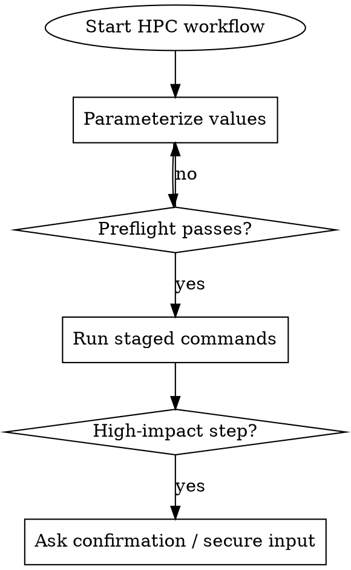

# HPC Training Operations

## Overview

Use this when acting on cluster notes that may contain stale usernames, paths, job IDs, or secret-bearing commands.
Core principle: parameterize first, preflight second, execute staged commands third.

## When to Use

- Slurm workflows (`sbatch`, `squeue`, `scancel`)
- Containerized jobs (`apptainer`/`singularity`)
- Dataset/checkpoint transfer (`scp`, `rsync`)
- Runtime debugging (`srun`, `nvidia-smi`, interactive shell)
- Scratch usage checks (`du`, `sort`)

Do not use for non-Slurm local training or cloud-only workflows.

## Authoritative Docs

When command behavior, scheduler settings, modules, or storage guidance is unclear, consult:
`cluster-profiles/<cluster_name>.md`.

If cluster is unknown, ask the user at session start which cluster they are using, then load the matching profile file.

If docs contradict this skill, propose updates and confirm before editing the skill text.

## Core Pattern

1. Set `SSH_ALIAS`, `UNIX_USER`, `PROJECT_NAME`, `PROJECT_CODE`, `PROJECT_DIR`, `SCRATCH_DIR`.
2. Preflight: host reachable, tools exist, paths/quota valid.
3. Run stages: setup -> transfer -> submit -> monitor -> debug -> cleanup.
4. Pause for confirmation on high-impact actions (`scancel`, overwrite sync, destructive cleanup).
5. Never inline secrets; use hidden prompt input or secure env handling.
6. If repo has `slurm/` scripts with profiles, submit from script path (not copied one-liners).



## Quick Reference

| Goal | Command Template |
|---|---|
| Login | `ssh <ssh_alias>` |
| Submit | `sbatch <slurm_script>.sh` |
| Submit profile | `sbatch <slurm_script>.sh <profile>` |
| Queue by user | `squeue -u <unix_user>` |
| Watch queue | `watch -n 1 squeue -u <unix_user>` |
| Cancel all your jobs | `scancel -u "$(whoami)"` |
| Copy local -> remote | `rsync -avz -P <local_path> <ssh_alias>:<remote_path>` |
| Copy remote -> local | `rsync -avz -P <ssh_alias>:<remote_path> <local_path>` |
| GPU stats for job | `srun --jobid=<job_id> --overlap nvidia-smi -l 1` |
| Interactive debug shell | `srun --nodes=1 --gres=gpu:1 --time=00:30:00 --pty /bin/bash` |
| Scratch usage | `du -sh <scratch_dir>` and `du -h --max-depth=1 <scratch_dir> \| sort -hr` |

## Implementation Example

Use this bootstrap before running setup/submit/monitor commands:

```bash
export SSH_ALIAS="<your_cluster_alias>"
export UNIX_USER="${UNIX_USER:-$(whoami)}"             # Or shortname.project if required
export PROJECT_NAME="<project_name>"
export PROJECT_CODE="<project_code>"
export PROJECT_DIR="$HOME/${PROJECT_NAME}"
export SCRATCH_DIR="/scratch/${PROJECT_CODE}/${UNIX_USER}/${PROJECT_NAME}"

ssh "$SSH_ALIAS" "hostname && command -v sbatch squeue scancel apptainer"
ssh "$SSH_ALIAS" "mkdir -p \"$PROJECT_DIR\" \"$SCRATCH_DIR\" && du -sh \"$SCRATCH_DIR\" || true"

# Optional repo-aware submit pattern
# ssh "$SSH_ALIAS" "cd \"$PROJECT_DIR\" && sbatch slurm/<script>.sh <profile>"
```

Private repo auth: do not embed PAT in URL.

## Rationalization Table

| Excuse | Reality |
|---|---|
| "Run my old notes exactly, no checks" | Stale paths and usernames break jobs; always preflight first. |
| "Hardcode my user/alias; it is faster" | Skills must be reusable; parameterize identity and paths. |
| "Paste token/API key inline for speed" | Inline secrets leak in history and logs; use env or secure prompts. |
| "Cancel everything now, we can recover later" | `scancel` is high impact; confirm scope before execution. |

## Red Flags - Stop and Re-check

- Commands contain hardcoded user handles, project IDs, or old job IDs
- Any secret appears inline (`PAT`, `WANDB_API_KEY`, tokenized git URL)
- Destructive commands run without confirmation (`scancel`, overwrite sync)
- Host/path assumptions are unverified (`~/...` vs `/scratch/...`)

All of these mean: pause, parameterize, preflight, then continue.

## Common Mistakes

- Mixing local and remote paths in one command
- Copying large datasets with `scp -r` when resumable `rsync -P` is needed
- Submitting without checking script/account/partition settings
- Running ad-hoc sbatch commands when repo `slurm/*.sh` already encodes the environment
- Monitoring wrong user (`squeue -u`) due hardcoded shortname
- Using container paths not mounted in `apptainer exec --bind`
